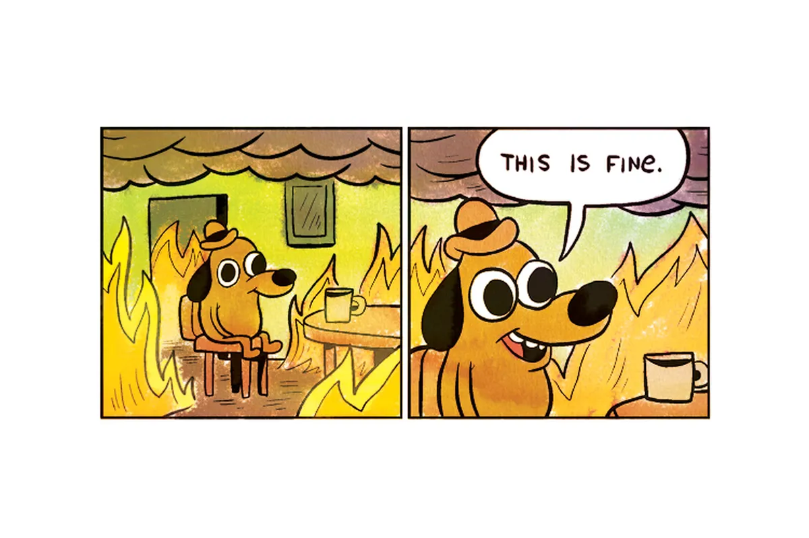
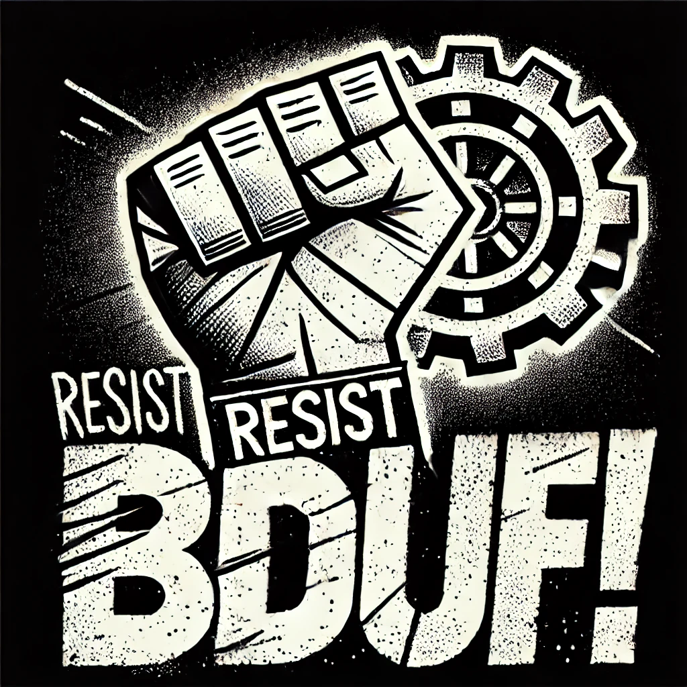

# HI!

---
<!-- _class: title_card -->

# (Tooling Our Way Out of)   The Cosmos Technical Debt Crisis

### (or, How I Learned to Stop Worrying and Love teh Agile)

---

<!-- paginate: true -->
<!-- footer: Tooling Our Way Out of the Cosmos Technical Debt Crisis-->

## What do we mean by "tool"?

> That which enables us to achieve more than we could unaided

> "We shape our tools, and thereafter they shape us".  — McLuhan

<!--
- tools can be techniques
- tools can be values
- THIS TALK IS A CALL TO ARMS

 -->

---

### Strangelove loves to make tools
- `Spawn`
- `Interchaintest`
- `Cosmos Operator`
- `Heighliner`
- etc.

<!--
- this isn't that kind of talk
- go to Reece's workshop, details at the end
-->
---

*By their nature*

## Decentralized Systems Are  Robust And Resilient   (our Natural Advantage)

*but*

## The Cost is   a Heavy Coordination Load   (our Natural Weakness)

---

## Do any of these sound familiar?

- 🤮 "self-eating dependency graph"
- 🤮 forks & cost upstream maintenance
- 🤮 direct correlation bw size of project and how bespoke it's become?
- 🤮 timelines are slow and unpredictable; cycle time is a killer
- 🤮 requirements aren't ACTUALLY what the user needs
- 🤮 (or are obsolete by the time they get to market)

---

## The good news
- THESE ARE SOLVED PROBLEMS
- software development has 20+ years dealing with this
- …we just need to look past the dross of the Agile Industrial Complex and get past bad experiences

---
<!-- _class: invert -->

## Why listen to me?
- Web 2 {design, engineering, product}
- blockchain found me
- How I got here

---

## <!--fit--> 🤠💉🏀

<!--

- cowboy culture =>
- methadone clinic
- midnite bball

 -->

---
<!-- _class: roman -->

## The Plan
0. The Backstory
1. The Stakes
2. The Way Out
3. The Nitty-Gritties
4. The Recap

---
<!-- _footer: "" -->
<!-- _paginate: false -->
<!-- _class: chapter -->

## <!-- fit --> 0. The Backstory

---

#### Previously, on _The 20th Century_
- WWII leaves USA as the only major intact industrial base
- 1960s: Japan is making terrible cars
- 1980s: Japan is making incredible cars
- Why? "Lean Manufacturing" i.e., *the Toyota Production System*

<!--
- Andon Cord: productivity plummeted, but quality started to improve.
 -->

---

<!-- _footer: "" -->

## Describe *Lean* while standing on one foot:
# <!--fit--> "Minimize Waste"

|    |             |              |
|----|-------------|--------------|
| 🗑️ | Muda (無駄) | "Waste"      |
| 🎢 | Mura (斑)   | "Unevenness" |
| 🏋️ | Muri (無理) | "Overburden" |

---

### Lean Manufacturing identifies 7 forms of Waste:

1. waste of *Inventory*
2. waste of *Over-Production*
3. waste of *Extra Processing*
4. waste of *Transportation*
5. waste of *Waiting*
6. waste of *Motion*
7. waste of *Defects*

<!--
- these are easy to imagine in a car factory.
- examples:
  - inventory: JIT
  - motion: this worker has to walk 50 yards to get one piece and another 50 to the next. easy fix

 -->

---

<!-- _class: invert -->
<!-- _footer: "" -->

### <!-- fit --> ~20 years later

---

###  *Lean Software Development: An Agile Toolkit*  by Mary & Tom Poppendieck

| Manufacturing Waste of... | Maps to Software waste as...                |
|---------------------------|---------------------------------------------|
| *Inventory*               | 🧩 Partially Done Work (or Work In Process) |
| *Over Production*         | 🤷 Delivering Extra or Unneeded Features    |
| *Extra Processing*        | 🔁 Relearning                               |
| *Transportation*          | 🙅 Handoffs                                 |
| *Waiting*                 | ⌛ Delays                                    |
| *Motion*                  | 🌪️ Context Switching                        |
| *Defects*                 | 🐞 Defects                                  |

<!--
- 2003 *Lean Software Development: An Agile Toolkit Mary* by Mary & Tom Poppendieck
- adapts Lean Manufacturing for...uh...Software
-->

---
<!-- _class: cent -->
<!-- _footer: "" -->
## <!-- fit --> Any of this sounding familiar?

---

<!-- _class: chapter -->
<!-- _footer: "" -->
<!-- _paginate: false -->

## <!-- fit --> I. The Stakes

---

<!-- _class: invert -->

## The Appchain thesis is better
## The Appchain thesis is losing

---
<!-- _class: cent -->
<!-- _footer: "" -->

### BUT! If we get this right
### <!--fit--> IT'S A COMPETITIVE ADVANTAGE
### (versus the rest of Web 3)

---

### What does failure look like?
- ETH / SOL / L2s press their TVL / penetration gains
- They catch up w/ our PoS-in-production lead
- crypto becomes another Inferior Tech Wins story,
(e.g. *VHS-vs-Beta* or *Qwerty-vs-Dvorak*)

### What does success look like?
- ETH / rollup thesis has peaked
- significant incumbent investment in Appchains
- clear path to appchain-TVL-surpasses-rollup-TVL

<!--
- broadly speaking, this is what I have in mind
 -->

---

## Why are we at risk?
- Unreliable Delivery
- Unsustainable Builds
- Poor Lotto Count
- High Cost Of Change

---

### Do Cosmos Pains map to Lean waste?

|                                                                       |        |
|-----------------------------------------------------------------------|--------|
| 🤮 "self-eating dependency graph"                                     | 🙅🔁🐞 |
| 🤮 forks & cost upstream maintenance                                  | 🤷🙅🌪️ |
| 🤮 direct correlation bw size of project and how bespoke it's become? | 🤷🐞   |
| 🤮 timelines are slow and unpredictable; cycle time is a killer       | 🧩⌛    |
| 🤮 requirements aren't ACTUALLY what the user needs                   | 🤷🙅   |
| 🤮 (or are obsolete by the time they get to market)                   | ⌛      |

<!--
- Yes
 -->

---

# What's missing from this description of "waste"?

---

<!-- _footer: "" -->

<!--
- we feel this as Debt
 -->

---
<!-- _paginate: false -->

## 🗑️ Waste != "Debt"  (though we often conflate the two)
## Tech Debt != 💩 Bad Code 💩
## Tech Debt == the freedom to choose *when* to spend work effort optimizing code

<!--
- the title of this talk uses "debt", but that's to get yr attention. Waste deserves attention too.
- code is a tool
- product => happy users => revenue is the goal
-->

---
<!-- _class: invert -->
# In software development,  👺 *Premature Optimization* 👺 is the mind killer

---

### <!--fit--> HMW escape this {debt, waste} trap?

---
<!-- _footer: "" -->
<!-- _paginate: false -->
<!-- _class: chapter -->

## <!-- fit --> II. The Way Out

---

<!-- _class: invert -->

## What if we stopped forgetting what worked well last time?

<!--

- ooooh! puppies instead of fire!

There is a way: ~trad'l XP
- TDD
- Pairing
- CI/CD
- Kaizen -->

---

### What might translate from Web 2..3?

|    | Lean software Muda             | Web 2 (XP) remedy                         | Works for Web 3?                                      |
|----|--------------------------------|-------------------------------------------|-------------------------------------------------------|
| 🧩 | *Partially Done Work (WIP)*    | WIP Limits                                | ✅                                                     |
| 🤷 | *Delivering Unneeded Features* | Validating Assumptions                    | ✅                                                     |
| 🔁 | *Relearning*                   | strong Lotto Count, pair-programming, CoC | ✅                                                     |
| 🙅 | *Handoffs*                     | autonomuous, x-fct'l teams                | ❓ Is w3 too specialized for x-fct'l?                  |
| ⌛  | *Delays*                       | reduce deps, bring related work together  | ❓ Is decen inimical to "bring related work together"? |
| 🌪️ | *Context Switching*            | WIP Limits                                | ✅                                                     |
| 🐞 | *Defects*                      | BDD, TDD                                  | ✅                                                     |

---

### <!--fit--> Atoms vs. Bits

<!--
- there's a difference ppl didn't recognize when introducing "eng'g"
- building w/ atoms: cost of {plan, build}
- building w/ bits
- == agile
-->

---

 
#### The Old Way

*optimize for predictable timelines*.

#### The Right Way

*optimize for low cost-of-change*.

---
<!-- _class: cent -->
<!-- _footer: "" -->
### The "Standing on one foot" version:

### <!-- fit --> _Optimize for   Short Feedback Loops_
###  (...all the rest is commentary...)

<!--

- I've been avoiding the word "Agile" in case there're any snowflakes in the audience
- there's a story about a learned religious sage...
- for {tech, team, product}

 -->

---

<!-- _class: invert -->
<!-- _paginate: false -->

---

<!-- _class: invert -->
<!-- _paginate: false -->

<!--

- right about here is where ppl get scared
 -->

---
<!-- _class: invert -->
<!-- _footer: "" -->
<!-- _paginate: false -->

### Fear leads to Anger
### Anger leads to Hate
### Hate leads to Suffering

---

<!-- _footer: "" -->
### Continuous Iterative Development

###### Why?
- Premature Optimization is the Mind Killer
- Learning Requires Mistakes

###### How?
- Optimize for **Small Feedback Loops**
- By default, *Show Your Work*
- Fidelity Of Planning Must Be Appropriate ("Flag Down The Beach")
- Resist BDUF ("Big Design Up Front")

---

<!-- _class: invert -->
<!-- _paginate: false -->
<!-- _footer: "" -->

## 🚨 SPOILER ALERT 🚨
## "Agile" is the old word for "Decentralization"

---

<!--  -->

| Original Manifesto (2001)                                      |   | Modern Agile (2016)           |
|----------------------------------------------------------------|---|-------------------------------|
| **Individuals and interactions**   over processes and tools | ➡️ | 🟨 Make People Awesome        |
| **Working software**   over comprehensive documentation     | ➡️ | 🟩 Deliver Value Continuously |
| **Customer collaboration**   over contract negotiation      | ➡️ | 🟦 Make Safety a Prerequisite |
| **Responding to change**   over following a plan            | ➡️ | 🟥 Experiment & Learn Rapidly |

<!--
- it's been gross for a while
- in 2016, distilled down to Modern Agile
- I think it does a good job simplifying and refining
- "refactor"?
- brilliantly simple: it's just a good idea and a sticker
- wasn't enough to dislodge the Agile Industrial Complex

 -->

---
<!-- _class: invert -->

### Hypothesis:

- I (we?) believe **Web 3 engineering culture**
- **Burns tons of energy re-inventing wheels**,   and chronically suffers from problems which have known solutions.
- We can fix this by **revisiting those Wheels and Solutions**  (which are feasible and cheap to implement), and
- We'll know we're right if we see **positive (qualitative) feedback,  improved (quantitative) cycle times, and healthier code**  (as measured by static analysis, defect rates, etc. etc.)

---
<!-- _footer: "" -->

### <!-- fit --> So how exactly  does this work?

<!--
- YMMV, but
- this works piecemeal and gradually
- if any of this sounds interesting, ask
- how can I get my team to start experimenting on Monday?

 -->

---
<!-- footer: "" -->
<!-- _class: chapter -->

## <!-- fit --> III. The Nitty-Gritties

<!--
- note: you can start doing most of these on monday
- you can start doing these gradually
- KEEPING THE COST OF CHANGE LOW
- -->

---
<!-- _class: promise -->

##### 🏋️ Doing more work than we need to
#### Minimize energy spent making trivial choices

### Convention over Configuration
- Always reserve the ability to configure based on local conditions, but otherwise
- Agree on conventions for the 80% of every project which is boilerplate

---

<!-- _class: promise -->

##### 🤷 Unclear Definition of "Done" at the ~Epic level
#### A shared, falsifiable understanding of "MVP"

### Lean Hypotheses

    We believe [TYPE OF USER]
    has a problem [DOING THING].
    We can help them with [OUR SOLUTION].
    We'll know we're right if [CHANGE IN METRIC].

---

<!-- _class: promise -->

##### 🤷 Unclear Definition of "Done" at a Story level
#### Cheap, simple confidence in shared expectations

### Well-Formed Stories

1. Describe *Acceptance Criteria in Gherkin* ("Given", "When", "Then", "And")
2. Describe *motivation* using `As a...` / `I want to...` / `Because...`
3. Story titles ought to include the word *"should"*

---

<!-- _class: promise -->

##### 🔁 No sane defaults for team communications
#### {Minimal, necessary, sufficient} expectations for team communications

### {FUTURE, PRESENT, PAST, CADENCE}.  Every team ought to agree on the *Canonical Source Of Truth* for:

|                                   |                                        |                                                         |
|-----------------------------------|----------------------------------------|---------------------------------------------------------|
| FUTURE plans                      | Where do we keep them?                 | Usually a backlog. GH Projects? Jira? A legal contract? |
| Conversations in the PRESENT      | How do we have them?                   | Slack? TG? Respond to emails that same day?             |
| Work that's been done in the PAST | What does it look like?                | Code repos? gDocs? ADRs?                                |
| CADENCE                           | What's our regular rhythm of meetings? | Responsible Recipe                                      |

---

<!-- _class: promise -->

##### 🏋️ Not enough time for real work
#### confine planning overhead to 7.5% of yr week. The other 37 hrs are for coding.

### A Responsible Recipe for Fewest Possible Meetings
- 50m weekly: Daily Standup (5x weekly, 10m each)
- 60m weekly: Iteration Planning Meeting ("IPM), 1x weekly, 60m each
- 60m weekly: Friday Afternoon Mtg (rotate bw Team Retro, Tech Retro, and Release Planning)

That's it. ~3hrs/wk for builders to keep teams and comms healthy.

---

<!-- _class: promise -->

##### 🏋️ Too many meetings
#### A shared, actionable, falsifiable rubric for "this mtg could have been an email".

### 💀 MEMENTO MORI MEETING TYPES

| Meeting                   | Outcome                   | example                                    |
|---------------------------|---------------------------|--------------------------------------------|
| DELIBERATION              | Decisions                 | whiteboard a feature, prioritize a backlog |
| BONDING                   | Relationships / bonds     | karaoke                                    |
| BIG NEWS                  | knowledge is disseminated | "We've exited!" or "${PERSON} is leaving". |
| **DO NOT CALL A MEETING** | Literally anything else   | email, information radiator, etc.          |

---

<!-- _class: promise -->

##### 🎢 Understanding the status of work
#### {Minimal, necessary, sufficient} vocabulary to talk about work being "done".
### Conventional story types

| Status                 | How do we know?                            |
|------------------------|--------------------------------------------|
| ☃️ Icebox               | **Unprioritized** but worth doing.         |
| 📋 Backlog             | Prioritized **unstarted** work.            |
| 🤸‍ In Progress          | **Active**ly being worked on.              |
| 👀 Waiting / In review | **Depends** on something we don't control. |
| 🥳 Done                | **No more effort** is required.            |

---

<!-- _class: promise -->

##### 🗑️ Which work ought we prioritize?
#### Optimize for "progress is the primary measured in working software"
### Conventional story states
|                   |                                                        |
|-------------------|--------------------------------------------------------|
| ⭐️ User story      | Least amount of work w/ User-facing value              |
| 🐞 Bug            | Regression (*not* new requirements)                    |
| ⚙️ Chore           | Anything w/o user-facing value                         |
| 👑 Epic           | Anything bigger than a story                           |
| 🏁 Release Marker | Anything w/ a fixed time (scope or cost *MUST* float ) |

<!--
- Tachometer vs Speedometer
- Iron Triangle: scope, cost, time

 -->

---
<!-- footer: Tooling Our Way Out of the Cosmos Technical Debt Crisis-->

### MORE TOOLS :
1. `Software Craftsmanship`
2. `Y.A.G.N.I.`
3. `Continuous Delivery => FEEDBACK LOOPS`
4. `The Right Kind of Laziness`
5. `Focus on Business Value`
6. `Ubiquitous Language (Eric Evans)`

---
<!-- _footer: "" -->
<!-- _class: wall -->

### EVEN MORE TOOLS

#### `"Done" means Done, Align the {Easy，Right} Thing to Do`, `Behavior-Driven Development (BDD)`, `Big Design Up-Front ("BDUF")`, `Bikeshedding`, `Box' Law (_All Models Are Wrong; Some Are Useful_)`, `Build ⤵️ Measure ⤵️ Learn ⤵️`, `Cargo Culting`, `Collective Ownership of Code`, `Comments Are Lies Waiting To Happen`, `Continuous Incremental Delivery`, `Convention Over Configuration`, `Definition of "Done"`, `Deliver Value Continuously`, `Enablement && Execution`, `Escaping the Build Trap`, `Experiment & Learn Rapidly`, `Experiment Backlog`, `Form ⤵️ Storm ⤵️ Norm ⤵️ Perform ⤵️`, `FUEP (Functional — Usable — Emotional — Persuasive)`, `FUTURE (Where do we keep plans?)`, `Grow the product through continuous validation`, `Lean Hypothesis`, `Listen to yr users? Always. Believe them? Sometimes.`, `Low Cost of Change`, `Make It {Work，Right，Fast}`, `Make People Awesome`, `Make Safety a Prerequisite`, `Minimal Standard of Care`, `Modern Agile`, `Outcomes vs. Outputs`, `PAST (Why did we do that?)`, `Pivotal`, `PRESENT (How do we converse?)`, `Progress Is Primarily Measured By Shipping {Code，Product}`, `R.A.C.I.`, `Release early and often`, `Red ⤵️ Green ⤵️ Refactor ⤵️`, `Scrum`, `Short Feedback Loops`, `Small Batch Sizes`, `Software is a Team Sport`, `Story = Least Amt of Work w/ User-facing Value`, `Story = Placeholder for a Conversation`, `Strong Opinions Loosely Held`, `Sustainable Pace`, `Team != "Same ppl forever"`, `Team == rotation && low-cost ramp-up`, `Team Matrix ratio`, `Technique: "Technique"!`, `Test-Driven Development (TDD)`, `The Most Expensive Way To Learn Is By Building`, `Think ⤵️ Make ⤵️ Check ⤵️`, `Ubiquitous Language`, `Values vs. Recipes`, `W.A.Y.K.`, `Well-Formed Stories`, `What's The Least We Could Do That Might Possibly Work?`, `XP (eXtreme Programming)`, `Y.A.G.N.I. ("Ya Ain't Gonna Need It")`, `Yak Shaving`, & `Yesterday's Weather`.

---
<!-- _footer: "" -->
<!-- _class: invert -->

## <!-- fit --> OH ONE MORE THING

---

---

### GORDIAN is a brand new, TDD'd, modular, general consensus engine.

Drop-in Replacement for Comet BFT. Easily customize components such as consensus strategies, p2p networking algorithms, hashing schemes, and signature schemes. Supports multiple concurrent proposals and BLS signature aggregation. Addresses bottlenecks in mempool and peer-to-peer networking. Comprehensive documentation and sample implementations. Compatible with various back-end systems & optimizations, including different encoding formats and efficient hashing algorithms like Blake3. Implements ABCI++. Potential for 10-1000x performance improvements over existing solutions. Multiple concurrent proposers enable better scaling for blockchain networks. Easier to maintain than custom forks. BLS signature aggregation.

<!--
- last year at cosmoverse we announced Gordian
- this year, we're open-sourcing it
- need server v2, looking for feedback, open sourcing soon
- we're modeling "by default, show your work" and "ship early and "short feedback loops"

 -->

---
<!-- _footer: "" -->
<!-- _class: chapter -->

## <!-- fit --> IV. The Recap

---

1. As an ecosystem, we're being crushed by tech debt
2. As an ecosystem, we're working harder than we need to
3. As an ecosystem, there's competitive advantage in getting it right
4. There are cheap, effective answers in the Old Ways
5. Which of this makes sense to start trying on Monday?
6. Follow up w/ Strangelove or the ICF to learn more or get help

---

<!-- _class: invert -->

## <!-- fit --> Thanks!

- @strangelovelabs
- @sick_fade
- @reecepbcups' _Interchain Intro Hackmos Workshop_, Friday, 10:30am

<!--
- QR code is for Hackmos; GO TO HACKMOS!

 -->
